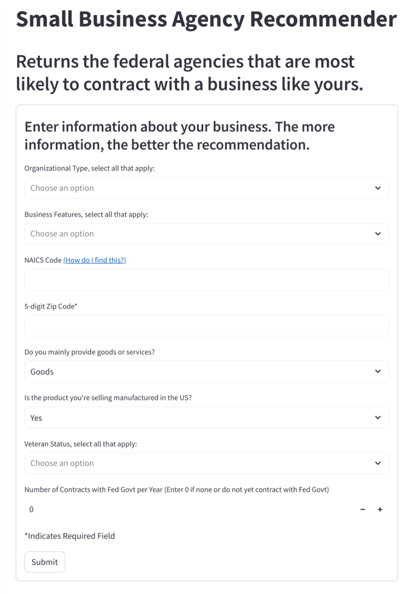
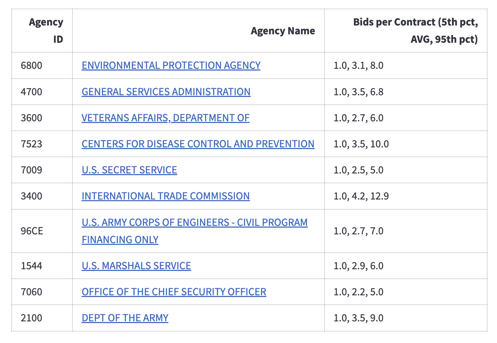
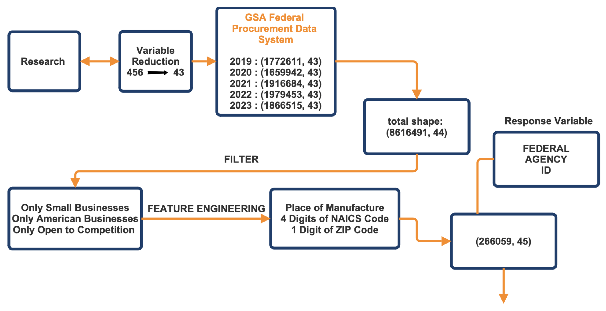

# small-business-agency-recommender
---

# Small Business Agency Recommender

Predicting Federal Purchasing Behavior Using Machine Learning

---

## 📌 Overview

Machine learning system that recommends **federal agencies most likely to contract with a small business**, transforming a complex marketplace into a ranked, actionable shortlist.

This project delivers clear, real-world impact by turning a complex and time-intensive federal contracting process into a targeted, data-driven decision tool. By reducing the search space from **300+ agencies to a ranked shortlist of high-probability matches**, it enables small businesses to focus their efforts where they are most likely to succeed, improving efficiency and reducing wasted time and resources. The addition of competition insights further supports smarter strategic decisions, allowing users to prioritize opportunities with more favorable odds. **This system demonstrates how machine learning can directly expand access to opportunities—particularly for small and underserved businesses navigating a highly complex market.**

---

## 🚀 Key Results

* **94% Top-20 accuracy** across ~300 agencies
* **10–20% improvement** over baseline approaches
* Reduced search space from **300+ agencies → top 20 recommendations**
* Built using **8.6M+ federal procurement records**

---

## ❗ Problem

Small businesses entering federal contracting face:

* No clear mapping between business characteristics and agencies
* High cost of trial-and-error bidding
* Time-intensive research across hundreds of agencies

---

## 💡 Solution

A **machine learning recommendation engine** that:

* Predicts agencies most likely to contract with a business
* Ranks them based on likelihood
* Provides competition insights (bids per contract)

---

## ⚙️ System Pipeline

* Data ingestion → feature reduction → feature engineering
* Model training (Random Forest)
* Ranking predictions (Top-N agencies)

---

## 🖥️ Product Interface

### Input → Output (User Experience)

**Input:**

* Business type, NAICS, ZIP
* Certifications (veteran, small business, etc.)
* Prior contract experience

  

**Output:**

* Ranked agency recommendations
* Competition metrics
* Direct links to agencies

  

---

## 📊 Data

* Source: GSA Federal Procurement Data System
* Timeframe: 2019–2023
* Scale:

  * 8.6M+ transactions
  * 450+ features → reduced to ~44
 

  

---

## 🤖 Modeling Approach

| Model                  | Outcome                             |
| ---------------------- | ----------------------------------- |
| Logistic Regression    | Limited with categorical complexity |
| Gradient Boosted Trees | Performance instability             |
| **Random Forest**      | Best performance (selected)         |

* 1000 trees
* Captures nonlinear relationships and feature interactions

---

## 📈 Results

| Metric     | Final Model | NAICS Only | Distribution |
| ---------- | ----------- | ---------- | ------------ |
| Top-1      | 72%         | 49%        | 33%          |
| Top-5      | 87%         | 69%        | 71%          |
| Top-10     | 91%         | 73%        | 80%          |
| Top-15     | 92%         | 78%        | 83%          |
| **Top-20** | **94%**     | 82%        | 86%          |

**Key Insight:**
The model performs best in **Top-N ranking**, aligning with real-world decision-making behavior.

---

## 🎯 Why This Matters

* Replaces manual agency search with **data-driven targeting**
* Improves efficiency for small businesses
* Supports **federal equity and accessibility initiatives**

---

## 🔁 End-to-End ML System

* Large-scale data processing (8M+ rows)
* Feature engineering for usability
* Model training and evaluation
* Deployment as an interactive dashboard

---

## ⚠️ Limitations

* No bid-level data → cannot predict win probability
* Financial data inconsistencies
* Class imbalance across agencies
* Reliance on historical patterns

---

## 🔮 Future Work

* Predict probability of winning contracts
* Estimate expected contract value
* Improve categorical encoding
* Integrate into government platforms

---

## 🧠 Final Note

This project demonstrates the ability to:

* Work with **large-scale real-world data**
* Build **end-to-end machine learning systems**
* Translate models into **practical, user-facing tools**
* Solve a **high-impact business problem with measurable outcomes**

